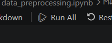

# Traffic-Based Route Guidance System (TBRGS) - Assignment 2B

## Project Overview

The **Traffic-Based Route Guidance System (TBRGS)** is an advanced routing engine developed for **Assignment 2B**. It is designed to navigate the complex traffic patterns of the Boroondara area in Melbourne. By combining state-of-the-art **Deep Learning** models for traffic flow prediction with robust **Graph Algorithms**, the system identifies the top-K fastest routes based on real-time traffic forecasts rather than static distances.

### Core Knowledge
- **Deep Learning Predictions**: Utilizes LSTM, GRU, and a custom spatial-temporal GCN-LSTM to predict traffic volumes.
- **Dynamic Cost Calculation**: Converts predicted vehicle flow into travel time using the VicRoads speed-flow quadratic model.
- **Top-K Routing**: Implements **Yen's Algorithm** on top of **A*** to provide multiple optimal route options.
- **High-Fidelity GUI**: A React-based interactive dashboard with Leaflet maps and OSRM road-snapping.

---

## Installation & Setup

### 1. Prerequisites
Ensure you have the following installed:
- **Python 3.11+**: https://www.python.org/downloads/
- **Node.js 18+**: https://nodejs.org/

### 2. Go to Assignment 2B Repository
```bash
cd Assignment2B
```

### 3. Backend Setup (Flask & ML)
The backend serves the ML models and handles routing requests.

1. **Create a virtual environment**:
   ```bash
   python -m venv venv
   venv\Scripts\activate
   ```
2. **Install dependencies**:
   ```bash
   pip install -r requirements.txt
   ```

### 4. Frontend Setup (React & Vite)
The GUI provides the interactive map interface.

1. **Navigate to the frontend directory**:
   ```bash
   cd gui/boroondara-tbrgs/frontend
   ```
2. **Install dependencies**:
   ```bash
   npm install
   ```

### 5. Jupyter Notebook Setup (Data Preprocessing & Model Training)
To run the notebooks directly in **VS Code**:

- Open any `.ipynb` file in the `notebooks/` directory.
- Click **Run All** to execute the cells (this will prompt you to select a kernel).

- Choose **Python 3.11 (TBRGS)** from the kernel selection popup.
   *Note: Ensure you run all cells in both `data_preprocessing.ipynb` and `data_preprocessing_custom_gcn_lstm.ipynb` to generate the necessary model input data.*

---

## Running the Program

To see the system in action, you need to run **both** the backend and the frontend simultaneously.

### Step 1: Start the Backend API
In a terminal window (with the virtual environment activated):
```bash
cd gui/boroondara-tbrgs/backend
python app.py
```
- The backend will start on `http://127.0.0.1:5001`.
- It will automatically link to the `models/` and `data/` directories located in the project root.

### Step 2: Start the Frontend GUI
In a **separate** terminal window:
```bash
cd gui/boroondara-tbrgs/frontend
npm run dev
```
- Open your browser and navigate to the address shown (usually `http://localhost:5173`).

---

## Using the Interface

1. **Select Origin & Destination**: Choose two SCATS intersection IDs from the dropdown menus.
2. **Configure Parameters**:
   - **Model**: Choose between LSTM, GRU, or Custom GCN-LSTM (Standard or Bidirectional).
   - **Departure Time**: Set your planned journey time to fetch the correct traffic predictions.
   - **Speed Limit & Delay**: Adjust the global speed limit and intersection traversal delay (default: 60km/h and 30s).
   - **Top K**: Select how many alternative routes you want to see.
3. **Find Routes**: Click the button to compute the paths. The map will update with color-coded routes and travel time cards.

---

## Data & Model Details

### Machine Learning Models
- **Standard Sequence Models**: 2-layer LSTM and GRU architectures.
- **Spatial-Temporal (GCN-LSTM)**: Custom Graph Convolutional Network that processes the SCATS adjacency matrix alongside temporal traffic sequences.
- **Features**: Day of week, hour of day (cyclical encoding), and historical 15-minute volume lags.

### Data Source
- **SCATS (Sydney Coordinated Adaptive Traffic System)**: Raw traffic data from the Boroondara region.
- **Preprocessing**: Data was aggregated into 15-minute intervals and converted from wide-format sensor counts to structured time-series sequences.

---

## Project Structure

- `/data/preprocessed`: Contains `.pkl` files for ML inference.
- `/gui/boroondara-tbrgs`: Main application entry points.
- `/integration`: Core routing logic and algorithm implementations (`yens.py`, `main.py`).
- `/map_data`: Geo-coordinates and graph edge definitions.
- `/models`: Pre-trained model weights (`.keras`, `.pth`) and scalers.
- `/notebooks`: Development logs and training scripts for all models.


